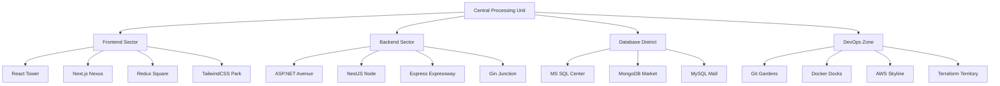

```
 ╔═══════════════════════════════════════════════════════════════╗ 
 ║ CHANAKORN ARAMSAK                                             ║
 ║ ═══════════════════                                           ║
 ║ Full Stack Developer | Cloud Enthusiast | Problem Solver      ║
 ╚═══════════════════════════════════════════════════════════════╝
      │
    ┌─┴─┐
    │CPU│
    └───┘
```

## Welcome to My Digital Circuit City! 🏙️💻

Here's where bytes become buildings and algorithms form avenues. Let's explore the districts that make up my technological metropolis!

### 🏭 Industrial District: Skills & Technologies



### 🏙️ Downtown: Professional Experience

1. **TCG Towers** (May 2023 - July 2023)
   - 🏗️ Constructed high-performance web applications
   - 🔧 Engineered 90% faster load times
   - 🔐 Implemented OAuth2 security protocols
   - 🗃️ Optimized data flow for 1M+ record databases

2. **Khunlook Tech Park** (May 2024 - Present)
   - 🔑 Developed robust authentication systems
   - 🧹 Refactored and standardized 80% of API infrastructure
   - 🧪 Implemented Test-Driven Development practices
   - 🏃‍♂️ Operated in an Agile development environment

### 🏛️ Innovation Quarter: Key Projects

1. 🏫 **Khunlook Academy**: A state-of-the-art Nursery Classroom Management System
2. 📚 **BookBix Library**: A next-gen book management platform (NestJS, MongoDB, Stripe)
3. ☁️ **Terraform Cloudworks**: Automated WordPress deployment in the AWS Cloud
4. 📦 **myDropbox Vault**: Secure file management system integrated with AWS S3 & Lambda
5. 💉 **VaccineBooker**: Streamlined vaccine appointment system (React, Next.js, Redux)

### 🎓 University District

**Chulalongkorn University**
- Degree: Bachelor of Computer Engineering
- Graduation: July 2024

### 🌉 Connect Bridge

Let's establish a connection:

<a href="https://www.linkedin.com/in/chanakorn-aramsak/">
  
</a>

<a href="mailto:chanakorn.aramsak@gmail.com">
  
</a>

```
 ╔═══════════════════════════════════════════════════════════════╗ 
 ║                                                               ║
 ║  "In the circuit of life, every connection counts.            ║
 ║   Let's build something extraordinary together!"              ║
 ║                                                               ║
 ╚═══════════════════════════════════════════════════════════════╝
```
